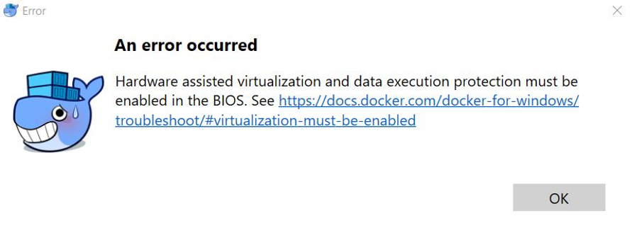
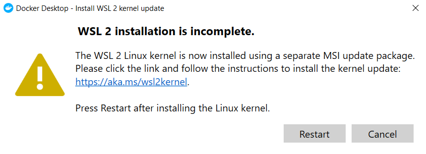
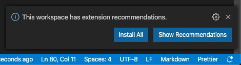
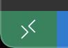
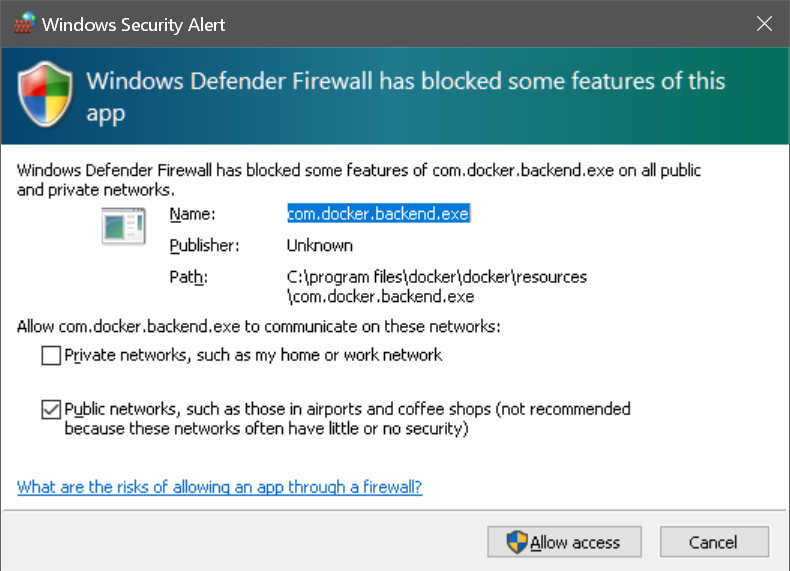
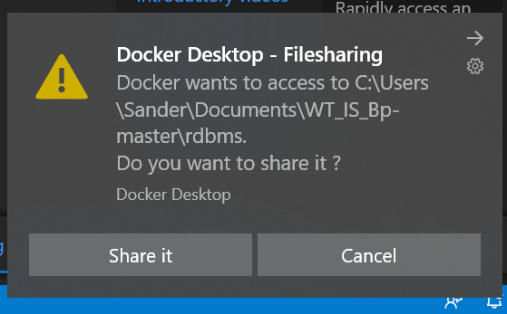
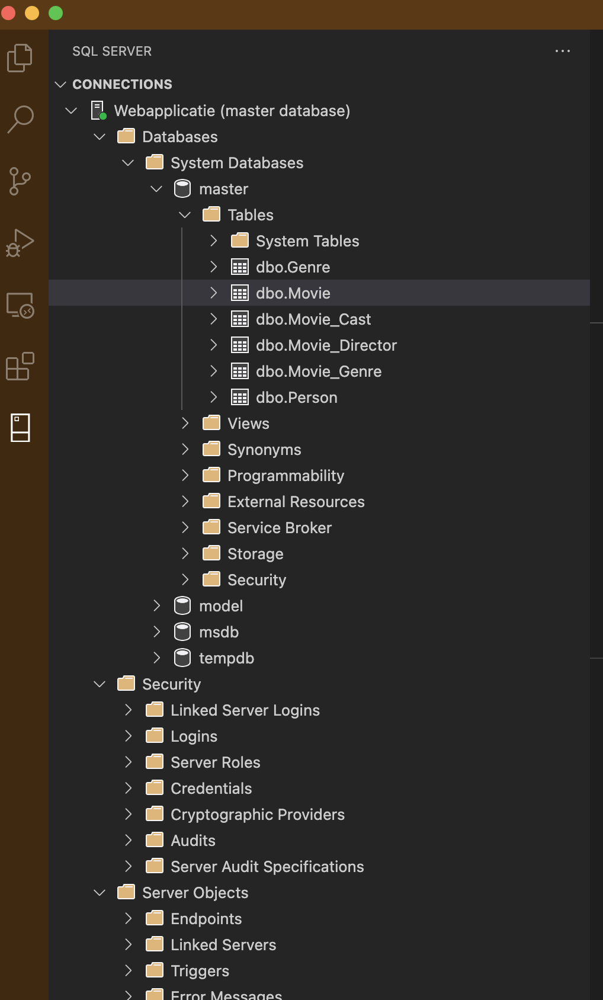
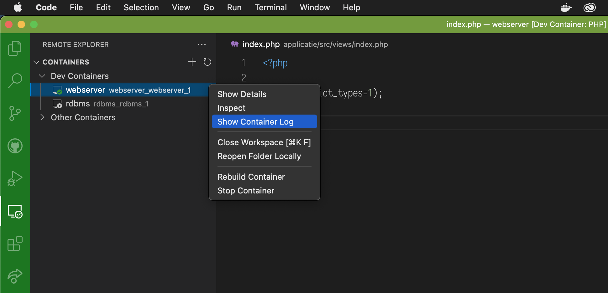
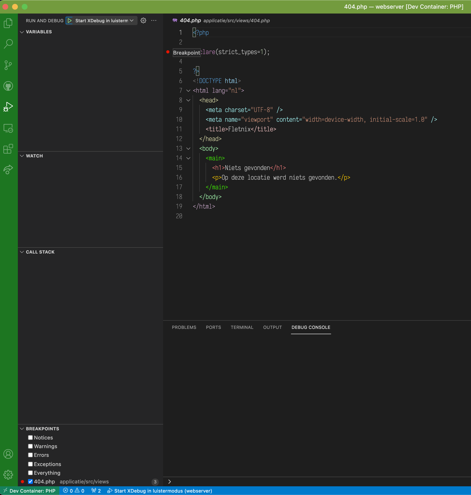

<!-- omit in toc -->
# WTIS - Beroepsproduct

- [Inleiding](#inleiding)
  - [Legenda](#legenda)
- [Stappenplan voor de start](#stappenplan-voor-de-start)
  - [0. Vereisten](#0-vereisten)
    - [Docker Desktop](#docker-desktop)
      - [Problemen oplossen onder Windows](#problemen-oplossen-onder-windows)
        - [Te oude computer](#te-oude-computer)
        - [WSL 2](#wsl-2)
        - [Detailinstructies over virtualisatie](#detailinstructies-over-virtualisatie)
      - [Hoe Docker instellen?](#hoe-docker-instellen)
  - [1. GitHub - Haal een kopie van dit project binnen](#1-github---haal-een-kopie-van-dit-project-binnen)
  - [2. VS Code - Open een nieuw venster voor SQL Server 🛢️](#2-vs-code---open-een-nieuw-venster-voor-sql-server-️)
  - [3. VS Code - Open de folder `rdbms` in het venster voor SQL Server 🛢️](#3-vs-code---open-de-folder-rdbms-in-het-venster-voor-sql-server-️)
  - [4. VS Code - Installeer de benodigde extensies](#4-vs-code---installeer-de-benodigde-extensies)
  - [5. VS Code - Activeer de dev container voor SQL Server 🛢️](#5-vs-code---activeer-de-dev-container-voor-sql-server-️)
    - [Alternatief](#alternatief)
    - [Bijzonderheden bij Windows](#bijzonderheden-bij-windows)
      - [Sta Docker netwerkverkeer toe (Windows Firewall)](#sta-docker-netwerkverkeer-toe-windows-firewall)
      - [Geef de dev container toegang tot bestanden (Docker Desktop)](#geef-de-dev-container-toegang-tot-bestanden-docker-desktop)
  - [6. VS Code - Open een nieuw venster voor PHP 📦](#6-vs-code---open-een-nieuw-venster-voor-php-)
  - [7. VS Code - Open de folder `webserver` in het venster voor PHP 📦](#7-vs-code---open-de-folder-webserver-in-het-venster-voor-php-)
  - [8. VS Code - Activeer de dev container voor PHP 📦](#8-vs-code---activeer-de-dev-container-voor-php-)
  - [9. Browser - Bezoek de website](#9-browser---bezoek-de-website)
  - [10. VS Code - Herstel de databasebackup met `sqlcmd` 🛢️](#10-vs-code---herstel-de-databasebackup-met-sqlcmd-️)
- [🧑‍🏫 Stappenplan voor doorontwikkeling](#-stappenplan-voor-doorontwikkeling)
  - [1. VS Code - Open de workspace in een nieuw venster](#1-vs-code---open-de-workspace-in-een-nieuw-venster)
  - [2. VS Code - Installeer de benodigde extensies](#2-vs-code---installeer-de-benodigde-extensies)
- [Vraag en antwoord](#vraag-en-antwoord)
  - [Hoe gaat deze template om met wachtwoorden/secrets?](#hoe-gaat-deze-template-om-met-wachtwoordensecrets)
    - [VS Code - Installeer de EditorConfig-extensie](#vs-code---installeer-de-editorconfig-extensie)
  - [Kan ik SQL Server ook nog buiten Docker om draaien (op de Docker host)?](#kan-ik-sql-server-ook-nog-buiten-docker-om-draaien-op-de-docker-host)
  - [Kan ik ook verbinding maken met de RDBMS vanuit VS Code, Azure Data Studio of SSMS?](#kan-ik-ook-verbinding-maken-met-de-rdbms-vanuit-vs-code-azure-data-studio-of-ssms)
  - [Kan ik de poort waarop de RDBMS luistert op de Docker host veranderen?](#kan-ik-de-poort-waarop-de-rdbms-luistert-op-de-docker-host-veranderen)
  - [Hoe kan ik dingen uitproberen en uitzoeken aan de database buiten PHP om?](#hoe-kan-ik-dingen-uitproberen-en-uitzoeken-aan-de-database-buiten-php-om)
  - [Hoe bekijk ik de logboeken van de containers?](#hoe-bekijk-ik-de-logboeken-van-de-containers)
  - [Hoe kan ik de webapp debuggen?](#hoe-kan-ik-de-webapp-debuggen)
  - [🧑‍🏫 Hoe kan ik versiebeheer met Git gebruiken?](#-hoe-kan-ik-versiebeheer-met-git-gebruiken)
- [Ontwerp](#ontwerp)

- 🧑‍🏫 **Ontwikkel je mee aan dit project**?
Zie de [workflow en richtlijnen](/.github/CONTRIBUTING.md).
- 👩‍🎓 **Ben je student**?
Houd je uitwerking van het beroepsproduct strikt privé!
Gebruik zelf geen GitHub.
Als je zelf toch GitHub gebruikt moet je zeker weten dat je uitwerking helemaal afgeschermd is.

---

## Inleiding

Dit is een template voor de uitwerking van het beroepsproduct, een website gebaseerd op PHP en SQL Server.
Dit project gaat uit van [Visual Studio (VS) Code](https://code.visualstudio.com/docs/getstarted/userinterface).

Dit project bestaat verder uit twee onderdelen:

- De [webserver](webserver/).
- Het [RDBMS, oftewel de databaseserver](rdbms/).

Wil je meer weten over deze specifieke onderdelen, zie dan de map van dat onderdeel.
Zo staat er uitleg bij de webserver over het startpunt dat daar geboden wordt voor je webapplicatie.

### Legenda

🧑‍🏫: alleen voor gevorderden.

## Stappenplan voor de start

Het is belangrijk dat je deze stappen **exact in deze volgorde en volledig** uitvoert om te kunnen beginnen met programmeren.

Voor een beginner zou dit eenmalig tien minuten kunnen duren.
Vervolgens, als je alles weg zou gooien, maar met ervaring, twee minuten.

### 0. Vereisten

- Zorg gedurende dit hele proces voor een werkende, snelle en betrouwbare internetverbinding.
Hapert je internet ergens, dan kan je soms de pech hebben dat je vreemde foutmeldingen krijgt.
- Installeer [VS Code](https://code.visualstudio.com/).
- [Installeer Docker](https://docs.docker.com/docker-for-windows/install/) van Docker Inc.
Dit project is getest met de variant [Docker Desktop](https://www.docker.com/products/docker-desktop).
- Als je Windows 10 Home gebruikt, dan kan Docker vragen om de Pro-editie te installeren, afhankelijk van hoe Docker ingesteld staat (namelijk voor de ‘Hyper-V backend’).
Als student mag je Windows 10 Home [**gratis** upgraden naar Windows 10 Pro Education](https://www.surfspot.nl/microsoft-windows-10-education-studenten.html).
[Pro ondersteunt allerlei bedrijfsmatige en technische functies](https://www.microsoft.com/en-us/windows/compare-windows-10-home-vs-pro) die ook handig kunnen zijn bij volgende courses.

#### Docker Desktop

##### Problemen oplossen onder Windows

###### Te oude computer

Heb je een te oude computer, dan kan je dit dialoogvenster krijgen:



*Fig. 1: Docker Desktop - An error occurred - Hardware assisted virtualization ….*

###### WSL 2

Zodra je Docker geïnstalleerd hebt kan je nog enkele waarschuwingen krijgen over WSL 2 ([*Windows Subsystem for Linux 2*](https://docs.microsoft.com/en-us/windows/wsl/about)).
WSL 2 is een extra onderdeel voor Windows waarmee Docker, Linux en andere technologieën efficiënt kunnen werken binnen Windows.

Als je een bericht krijgt dat WSL 2 niet geïnstalleerd is, volg dan de instructies op om WSL 2 wèl te installeren.

Daarna kan je onder andere nog de volgende melding krijgen:

> Please click the link and follow the instructions to install the kernel update: …

Installeer de kernel update zoals gevraagd.
Herstart je computer.



*Fig. 2: Docker Desktop - Install WSL 2 kernel update.*

###### Detailinstructies over virtualisatie

Mocht je nog steeds problemen hebben tijdens of direct na de installatie van Docker Desktop, bestudeer dan de instructies van Docker Inc. onder het kopje [*Virtualization*](https://docs.docker.com/docker-for-windows/troubleshoot/#virtualization-must-be-enabled), alleen die onder de subkopjes *‘VIRTUALIZATION MUST BE ENABLED’* en *‘WSL 2 AND WINDOWS HOME’*.

##### Hoe Docker instellen?

Zorg onder [*Settings* - *Resources*](https://docs.docker.com/docker-for-windows/#resources) voor de volgende instellingen:

- Stel niet minder in dan de standaardwaarde aan RAM-geheugen: 2 GiB.
- Houd verder rekening met ca. 5 GiB aan benodigde opslagruimte.

Als je dit niet kan instellen, gebruik je de WSL 2 backend.
Die regelt het geheugengebruik en de opslagruimte zelf.
Met WSL 2 hoeft Windows niet vooraf apart geheugen- en opslagruimte te reserveren voor Docker containers, dus WSL 2 werkt efficiënter.

### 1. GitHub - Haal een kopie van dit project binnen

Download dit project als een ZIP-archief.
Zie [_Cloning a repository using the command line_](https://help.github.com/en/github/creating-cloning-and-archiving-repositories/cloning-a-repository#cloning-a-repository-using-the-command-line), alleen stap 3.

### 2. VS Code - Open een nieuw venster voor SQL Server 🛢️

Via de menubalk bovenaan: _File_ > _New Window_.

N.B.: Dit venster is en blijft specifiek om te ontwikkelen aan of te werken met SQL Server.

### 3. VS Code - Open de folder `rdbms` in het venster voor SQL Server 🛢️

Via de menubalk bovenaan: _File_ > _Open..._ (macOS) of _Open Folder_ (Windows).
Selecteer de map `rdbms`, dus niet een bestand erbinnen.

📙 Als het goed is ziet dit nieuwe venster er oranjebruin uit.

### 4. VS Code - Installeer de benodigde extensies

Op een gegeven moment krijg je mogelijk de vraag of je de door deze workspace aanbevolen extensies wilt installeren.



*Fig. 3: This workspace has extension recommendations.*

Reageer in dat geval met _Install All_.

### 5. VS Code - Activeer de dev container voor SQL Server 🛢️

Op een gegeven moment krijg je de vraag of je de dev container binnen deze map wilt activeren.


*Fig. 4: Folder contains a dev container configuration file.*

Reageer met _Reopen in Container_.

Wacht rustig af tot VS Code in de blauwe balk onderaan geen activiteit meer vertoont.
Dit kan de eerste keer tot ca. vijf minuten duren, afhankelijk van hoe snel je internetverbinding en computer is.

#### Alternatief

Je kan een dev container ook altijd zelf opstarten of opnieuw aanmaken via het menu in de linkeronderhoek van ieder VS Code-venster waarin een dev container te vinden is.


*Fig. 4b: Linkeronderhoek VS Code-venster: bediening dev container.*

#### Bijzonderheden bij Windows

Als je Windows gebruikt, kan je een aantal dialoogvensters krijgen.

##### Sta Docker netwerkverkeer toe (Windows Firewall)

Bij de vraag of je Docker netwerkverkeer wilt toestaan,



*Fig. 5: Windows Defender has blocked some features of this app*

kies _Allow access_.

De suggestie dat Docker op publieke netwerken actief zou mogen worden komt door [een bekende beperking in Docker](https://github.com/docker/for-win/issues/367).

##### Geef de dev container toegang tot bestanden (Docker Desktop)

Bij de vraag of je de dev container toegang wilt geven tot bestanden,



*Fig. 6: Docker Desktop - Filesharing*

kies telkens _Share it_.
Doe dit onmiddellijk, want als je te lang wacht kan het stappenplan mis gaan.

### 6. VS Code - Open een nieuw venster voor PHP 📦

Via de menubalk bovenaan: _File_ > _New Window_.

### 7. VS Code - Open de folder `webserver` in het venster voor PHP 📦

Via de menubalk bovenaan: _File_ > _Open..._ (macOS) of _Open Folder_ (Windows).
Selecteer de map `webserver`, dus niet een bestand erbinnen.

📗 Als het goed is ziet dit nieuwe venster er groen uit.

### 8. VS Code - Activeer de dev container voor PHP 📦

(Deze instructies zijn gelijk aan de vorige stap genaamd _VS Code: activeer de dev container ..._.)

### 9. Browser - Bezoek [de website](http://127.0.0.1/)

Deze pagina werkt en toont tijdelijke ontwikkelinformatie van PHP.

### 10. VS Code - Herstel de databasebackup met `sqlcmd` 🛢️

Zorg ervoor dat je in het venster voor Webserver bezig bent.

⚠️ Getest is het herstellen van een [`.sql`-bestand met een basis-databasebackup van de Fletnix-database](rdbms/database/Fletnix_basis.sql).
Besef dat de database weer weg is als je alle Docker-containers weggooit (in ieder geval die van `rdbms`).
Dat kan al gebeuren als je Docker Desktop upgradet of reset.
Zorg ervoor dat al je wijzigingen/vulling van de database te herstellen is vanuit je eigen versie van dit backupbestand.
Werk niet met het invoeren van losse SQL-statements.
Dan is je werk niet goed reproduceerbaar!

Kies Menubalk > _Terminal_ > _New terminal_.

Gebruik `sqlcmd` om het backupbestand te herstellen:

```sh
/opt/mssql-tools/bin/sqlcmd -S 'rdbms' -U 'SA' -x -i '/tmp/fletnix.sql'
```
Voer nu het wachtwoord in zoals je die hebt gedefinieerd in [`./password_rdbms_admin.txt`](./password_rdbms_admin.txt)

Als alles goed is gegaan, zie je alleen output in de vorm van ‘x rows affected.’.
Dit geeft aan dat er nieuwe rijen aan tabellen zijn toegevoegd.

## 🧑‍🏫 Stappenplan voor doorontwikkeling

Volg eerst het [stappenplan voor de start](#stappenplan-voor-de-start).
Volg vervolgens deze extra stappen.

### 1. VS Code - Open de workspace in een nieuw venster

Open het bestand [`/webapplicatie.code-workspace`](/webapplicatie.code-workspace) als workspace (in een nieuw venster).
Zie: [_Opening workspace files_](https://code.visualstudio.com/docs/editor/multi-root-workspaces#_opening-workspace-files).

### 2. VS Code - Installeer de benodigde extensies

Op een gegeven moment krijg je mogelijk de vraag of je de door deze workspace aanbevolen extensies wilt installeren.


*Fig. 7: This workspace has extension recommendations.*

Reageer in dat geval met _Install All_.

Zie verder [Hoe kan ik versiebeheer met Git gebruiken?](#hoe-kan-ik-versiebeheer-met-git-gebruiken).

## Vraag en antwoord

### Hoe gaat deze template om met wachtwoorden/secrets?

Secrets, zoals database-wachtwoorden, worden in dit template veilig gebruikt.
Om dat mogelijk te maken is wel een handeling van jou vereist.

1. Wijzig in de hoofdmap van het project twee bestanden met VS Code:
    - `password_rdbms_app.txt` (*wachtwoord de `applicatie`-gebruiker* (`DB_LOGIN`), de database van je webapp)
    - `password_rdbms_admin.txt` (*wachtwoord van [`SA`, de beheerder van SQL Server](https://docs.microsoft.com/en-us/sql/database-engine/configure-windows/change-server-authentication-mode?view=sql-server-ver15)*)
2. Vul beide bestanden met [veilige wachtwoorden](https://docs.microsoft.com/nl-nl/sql/relational-databases/security/password-policy?view=sql-server-ver15).
⚠️ Als het wachtwoord niet voldoet aan deze vereisten zal de RDBMS niet starten en krijg je vreemde problemen.
3. Eindig beide bestanden met een witregel en sla het bestand op met ASCII-tekstcodering en Linux-regeleindes.
Dit gebeurt automatisch goed als je de EditorConfig-extensie instelt binnen VS Code, en vervolgens VS Code gebruikt om de bestanden op te slaan in plaats van bijvoorbeeld Windows Notepad.
Zie hiervoor de volgende paragraaf.

#### VS Code - Installeer de EditorConfig-extensie

Doordat iedereen een verschillend besturingssysteem gebruikt kunnen er problemen met het opslaan van bestanden ontstaan.
EditorConfig is een standaard die bepaalt hoe bestanden moeten worden opgeslagen.

Installeer de [EditorConfig-extensie](https://marketplace.visualstudio.com/items?itemName=EditorConfig.EditorConfig) in VS Code.
Klik daarvoor op de groene knop ‘Install’ bovenaan de webpagina.

### Kan ik SQL Server ook nog buiten Docker om draaien (op de Docker host)?

Ja, maar dit kan vreemde effecten geven als je op de Docker host zelf, buiten VS Code om, met bijvoorbeeld SQL Server Management Studio probeert te verbinden met de RDBMS-container.
Zie [`rdbms/docker-compose.yml`](rdbms/docker-compose.yml).
Het is meestal verstandig om alle overige SQL Server instanties te stoppen tijdens je werk aan dit project.

### Kan ik ook verbinding maken met de RDBMS vanuit VS Code, Azure Data Studio of SSMS?

Ja.
Gebruik als ‘Hostname’ `localhost,1433`.
Kies ‘SQL login’ als authenticatiemethode.

In VS Code (in het RDBMS-venster) zit al een extensie waarmee je de database kan verkennen.



*Fig. 8: De SQL Server-extensie in VS Code.*

### Kan ik de poort waarop de RDBMS luistert op de Docker host veranderen?

Ja, maar dat is meestal onverstandig.
Zie het antwoord op de voorgaande vraag.
Je kan dit doen door de sleutel `published` te veranderen in [`rdbms/docker-compose.yml`](rdbms/docker-compose.yml).

### Hoe kan ik dingen uitproberen en uitzoeken aan de database buiten PHP om?

In de dev container [SQL Server 2019](/rdbms/) staat de [SQL Server-extensie voor VS Code](https://docs.microsoft.com/en-us/sql/visual-studio-code/sql-server-develop-use-vscode?view=sql-server-ver15) standaard geïnstalleerd.

Ook kan je [SQL Server Management Studio (SSMS)](https://docs.microsoft.com/en-us/sql/ssms/download-sql-server-management-studio-ssms?view=sql-server-ver15) gebruiken.

### Hoe bekijk ik de logboeken van de containers?

Meer informatie over onder andere foutmeldingen van PHP wordt alleen in de logboeken vermeld.
De logboeken van SQL Server en de PHP webserver zijn in te zien via Docker.
Alleen het workspace-venster is daarvoor op dit moment speciaal uitgerust.

Kies de linker zijbalk > Docker-logo > _Containers_ > rechtsklik - _View Logs_.



*Fig. 9: Kies de linker zijbalk > Docker-logo > Containers > rechtsklik - View Logs.*

### Hoe kan ik de webapp debuggen?

De PHP-debugger XDebug is al geïnstalleerd en geconfigureerd.



*Fig. 10: Kies de linker zijbalk > Run and Debug. Klik linksbovenin op het play-knopje links naast _Start XDebug in luistermodus_. Klink links naast regelnummers (in de marge) om een breakpoint/stoppunt in te stellen.*

Zie [Debugging](https://code.visualstudio.com/docs/editor/debugging) voor gedetailleerde instructies over debugging.

### 🧑‍🏫 Hoe kan ik versiebeheer met Git gebruiken?

Alleen het workspace-venster is daarvoor op dit moment speciaal uitgerust (mits je zelf Git al op je computer hebt geïnstalleerd).
Ontwikkelen doe je dus in de dev containers oftewel de specifieke vensters, en Git-acties verrichten kan je tegelijkertijd vanuit het workspace-venster.

## Ontwerp

Dit template gebruikt [de ingebouwde webserver van PHP](https://www.php.net/manual/en/features.commandline.webserver.php), omdat dat (1) voor een minder ingewikkelde opzet zorgt en (2) voldoende is voor deze onderwijsopdracht.
